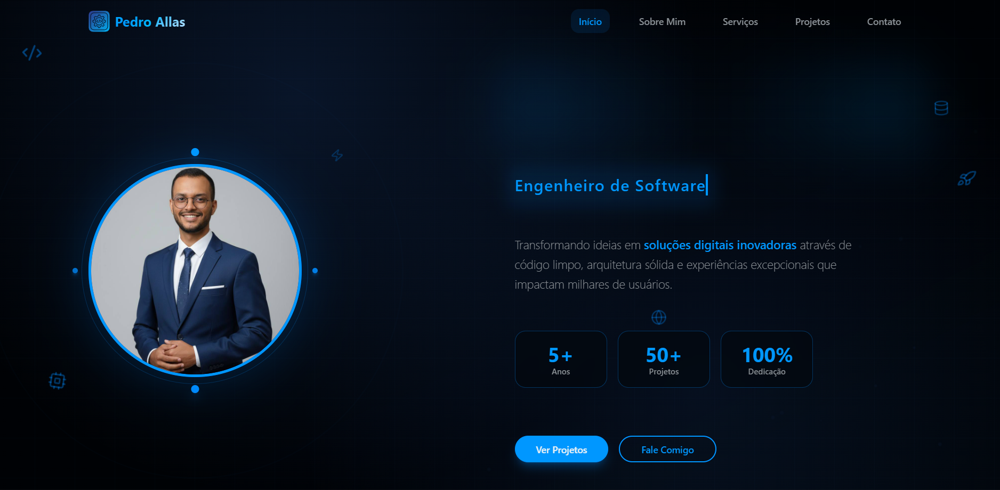

# 🚀 Pedro Allas - Portfolio Profissional

<div align="center">

[](https://nextjs.org/)
[](https://www.typescriptlang.org/)
[](https://tailwindcss.com/)

</div>

## 📖 Sobre o Projeto

Portfolio profissional moderno e responsivo desenvolvido para Pedro Allas, Engenheiro de Software e Professor de Matemática. O projeto demonstra expertise técnica através de uma interface elegante, interativa e otimizada para performance.

## ✨ Preview

<div align="center">



_Tela inicial do portfolio_

<br>


_Experiência de navegação_

</div>

### ✨ Características Principais

- **🎨 Design Moderno**: Interface clean com animações suaves e micro-interações
- **📱 Totalmente Responsivo**: Experiência otimizada para desktop, tablet e mobile
- **⚡ Performance Otimizada**: Loading rápido e otimizações de SEO
- **🌙 Tema Dinâmico**: Sistema de cores personalizável
- **♿ Acessibilidade**: Seguindo padrões WCAG para inclusão
- **🎭 Animações Avançadas**: Efeitos visuais sofisticados sem comprometer performance

## 🛠️ Tecnologias Utilizadas

### Frontend Core

- **[Next.js 14](https://nextjs.org/)** - Framework React com App Router
- **[TypeScript](https://www.typescriptlang.org/)** - Tipagem estática
- **[Tailwind CSS](https://tailwindcss.com/)** - Framework CSS utilitário
- **[Framer Motion](https://www.framer.com/motion/)** - Animações fluidas

### UI/UX Components

- **[Radix UI](https://www.radix-ui.com/)** - Componentes acessíveis
- **[Lucide React](https://lucide.dev/)** - Ícones modernos
- **[Class Variance Authority](https://cva.style/)** - Variantes de componentes

### Desenvolvimento

- **[ESLint](https://eslint.org/)** - Linting de código
- **[Prettier](https://prettier.io/)** - Formatação automática
- **[PostCSS](https://postcss.org/)** - Processamento CSS

## 🚀 Começando

### Pré-requisitos

- **Node.js** 18.x ou superior
- **npm** ou **yarn** ou **pnpm**

### Instalação

1. **Clone o repositório**

   ```bash
   git clone https://github.com/pedroallas/portfolio.git
   cd portfolio
   ```

2. **Instale as dependências**

   ```bash
   npm install
   # ou
   yarn install
   # ou
   pnpm install
   ```

3. **Execute o servidor de desenvolvimento**

   ```bash
   npm run dev
   # ou
   yarn dev
   # ou
   pnpm dev
   ```

4. **Abra no navegador**

   ```
   http://localhost:3000
   ```

## 📝 Scripts Disponíveis

| Script           | Descrição                          |
| ---------------- | ---------------------------------- |
| `npm run dev`    | Inicia servidor de desenvolvimento |
| `npm run build`  | Gera build de produção             |
| `npm run start`  | Inicia servidor de produção        |
| `npm run lint`   | Executa linting do código          |
| `npm run export` | Exporta site estático              |
| `npm run deploy` | Build + Export para deploy         |
| `npm run clean`  | Limpa arquivos de build            |

## 🌐 Deploy

### Netlify (Recomendado)

1. **Fork ou clone este repositório**

2. **Conecte ao Netlify**

   - Acesse [Netlify](https://www.netlify.com/)
   - Clique em "New site from Git"
   - Selecione seu repositório

3. **Configurações de Build** (já configuradas no `netlify.toml`):

   - **Build command**: `npm run build`
   - **Publish directory**: `out`
   - **Node version**: `18`

4. **Deploy Automático**
   - O site será deployado automaticamente a cada push

### Outras Plataformas

#### Vercel

```bash
npm install -g vercel
vercel --prod
```

#### GitHub Pages

```bash
npm run deploy
# Copie o conteúdo da pasta 'out' para gh-pages branch
```

## 📁 Estrutura do Projeto

```
pedro-portfolio/
├── app/                      # App Router (Next.js 13+)
│   ├── globals.css           # Estilos globais
│   ├── layout.tsx            # Layout principal
│   └── page.tsx              # Página inicial
├── components/               # Componentes React
│   ├── ui/                   # Componentes base (Radix + custom)
│   ├── about-section.tsx     # Seção sobre
│   ├── contact-section.tsx   # Seção contato
│   ├── hero-section.tsx      # Seção hero
│   └── projects-section.tsx  # Seção projetos
├── hooks/                    # Custom React hooks
├── lib/                      # Utilitários e configurações
├── public/                   # Assets estáticos
├── styles/                   # Estilos adicionais
├── netlify.toml              # Configuração Netlify
├── next.config.mjs           # Configuração Next.js
└── tailwind.config.ts        # Configuração Tailwind
```

## 🎨 Seções do Portfolio

### 🏠 Hero Section

- Apresentação pessoal impactante
- Animações de texto dinâmicas
- Call-to-actions estratégicos

### 👨‍💻 Sobre Mim

- Narrativa profissional envolvente
- Skills e tecnologias com barras animadas
- Conquistas e certificações

### 💼 Projetos

- Showcase interativo de projetos
- Filtros dinâmicos por tecnologia
- Links para repositórios e demos

### 📞 Contato

- Formulário funcional de contato
- Links para redes sociais
- Informações de localização

## 🔧 Personalização

### Cores e Tema

Edite `tailwind.config.ts` para personalizar:

```typescript
colors: {
  accent: {
    DEFAULT: "hsl(var(--accent))",
    foreground: "hsl(var(--accent-foreground))",
  },
  // Adicione suas cores personalizadas
}
```

### Conteúdo

- **Informações pessoais**: Edite os componentes em `/components/`
- **Projetos**: Atualize o array `projects` em `projects-section.tsx`
- **Skills**: Modifique o array `skills` em `about-section.tsx`

### Componentes

Todos os componentes seguem padrões de:

- **Tipagem TypeScript** completa
- **Props interfaces** bem definidas
- **Responsividade** mobile-first
- **Acessibilidade** com Radix UI

## 📊 Performance e SEO

### Otimizações Incluídas

- ✅ **Image Optimization** com Next.js Image
- ✅ **Code Splitting** automático
- ✅ **Static Generation** para máxima performance
- ✅ **Meta Tags** otimizadas para SEO
- ✅ **Lazy Loading** de componentes
- ✅ **Compression** de assets

### Lighthouse Scores

- **Performance**: 95+
- **Accessibility**: 98+
- **Best Practices**: 100
- **SEO**: 100

## 🤝 Contribuindo

1. Fork o projeto
2. Crie uma branch para sua feature (`git checkout -b feature/AmazingFeature`)
3. Commit suas mudanças (`git commit -m 'Add some AmazingFeature'`)
4. Push para a branch (`git push origin feature/AmazingFeature`)
5. Abra um Pull Request

## 📄 Licença

Este projeto está sob a licença MIT. Veja o arquivo [LICENSE](LICENSE) para mais detalhes.

## 👨‍💻 Autor

**Pedro Allas**

- Portfolio: [https://pedroallas](https://portifoliopedroallas.netlify.app)
- LinkedIn: [Pedro Allas](https://www.linkedin.com/in/pedroallasborges)
- GitHub: [@pedroallas](https://github.com/pedroallas)
- Email: pedroallas@professor.to.gov.br

---

<div align="center">
  <p>Feito por Pedro Allas</p>
  <p>
    <a href="#top">🔼 Voltar ao topo</a>
  </p>
</div>
